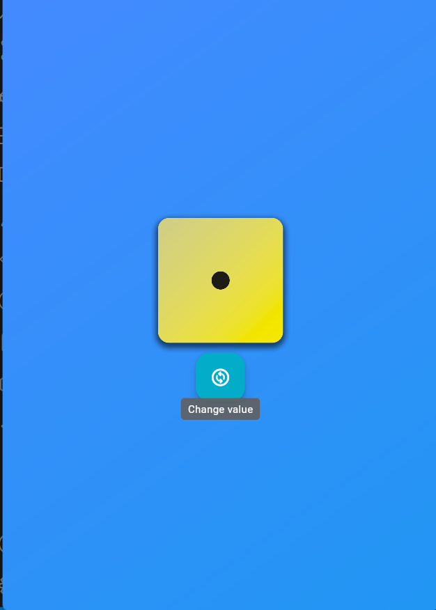

# Dice Roll App

## Description
This is a simple dice rolling application built using Flutter. It allows users to roll a virtual dice and view the result on their mobile devices.

## Screenshots




## Features
- Tap the button to roll the dice.

## Getting Started
To use this app, you need to have Flutter installed on your machine. If you don't have it, you can follow the installation instructions on the [Flutter website](https://flutter.dev/docs/get-started/install).

### Clone the repository
```bash
git clone https://github.com/waelfraj/dice_roll_app.git
cd dice_roll_app
```

### Run the app
```bash
flutter run
```

## Contributing
Contributions are welcome! If you find any bugs or want to improve the app, feel free to fork the repository and submit a pull request.

